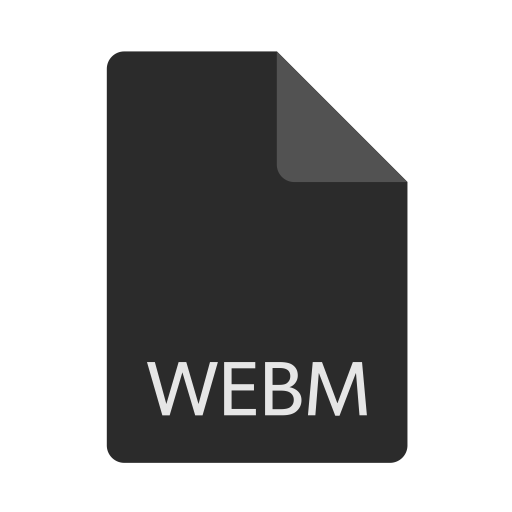

# WEBMer Bot


**With bot you can convert webm to mp4 and immediately post them to your Telegram channel as a video message! [Try it!](https://t.me/WebmerBot)**

Follow the updates on our [telegram channel](http://github.com)! 
Also, if you have any problems working with the bot, you can contact our [support group](http://github.com) for help.

## How to use
- Click on ```/start``` to start working with the bot. If this is not the first time you use WebMer, then it will apply your last settup.
- Press ```/setup``` or just forward to the bot any message from your channel/group!
- Just send to the bot link or file on webm video and bot convert it and send directly to your channel!
- Command ```/current``` will show your current active posting channel!

## Setup Bot
1. install [ffmpeg](https://www.ffmpeg.org/) on your PC
2. install dependencies from [requirements.txt](https://github.com/4knWnG/WEBMtoMP4-TG/blob/4f5519133b4960f9cb10b7004dd34b12b6a0c7b7/requirements.txt)
3. Get bot token from [@BotFather](https://t.me/botfather)
4. Create a [.env]() file and insert your token like this:
    ```TOKEN = YOUR TOKEN```

## Prerequisite
    ffmpeg

## Install dependencies
    pip3 install -r requirements.txt
